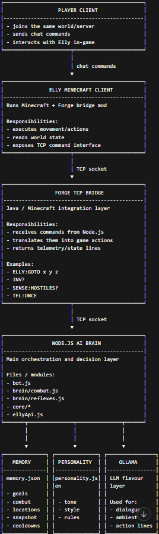

# Elly AI Agent

## Demo

This demo shows:

- natural language interaction (LLM)
- memory system (locations)
- real-time control (follow / goto)
- autonomous systems (sleep sync)
- gameplay features (farm, fight, mine)

[Watch the full demo]((https://youtu.be/a2Q9cDu7Eqg))

Elly is a modular Minecraft AI companion built with a real-time Node.js brain and a custom Forge TCP bridge.

The project combines deterministic gameplay logic with a controlled LLM personality layer (via Ollama), designed to avoid latency during critical actions.

---

## Architecture



---

## Features

* Real-time combat system (hostile mobs)
* Hunt mode (passive mobs)
* Smart retreat logic (home fallback + danger detection)
* Inventory and environment awareness
* Event-driven LLM dialogue (no impact on gameplay loop)
* Modular architecture (brain / core / API separation)

---

## Architecture

### Node.js (AI Brain)

* `bot.js` → main loop and orchestration
* `brain/` → combat + reflex systems
* `core/` → parsing, telemetry, inventory, environment
* `ellyApi.js` → TCP client wrapper
* `memory.json` → persistent runtime state
* `personality.json` → LLM behavior definition

### Forge Mod (Bridge)

* TCP server inside Minecraft
* Translates commands into in-game actions
* Sends telemetry (HP, position, inventory, environment)

---

## Tech Stack

* Node.js
* Minecraft Forge (1.20.1)
* TCP socket communication
* Ollama (LLM for personality layer)

---

## Design Principles

* Deterministic gameplay logic (no AI lag during actions)
* Event-driven LLM usage (flavour only)
* Modular and extensible architecture
* Robust parsing and fault tolerance

---

## ⚠️ Important: Minecraft Setup (2 Clients Required)

Elly requires **two Minecraft clients** to work correctly.

### Why?

A custom NPC-style implementation is possible, but it would require a much more complex architecture.

This project instead uses a dedicated Minecraft client for Elly and a separate player client, which provides a cleaner and more reliable setup for real-time control, debugging, and future expansion.
So the system is split:

* **Client 1 (Elly)** → runs the Forge mod + TCP bridge
* **Client 2 (Player)** → used by you to control the bot

---

### Setup Overview

#### Client 1 — Elly (Bot Client)

* Launch Minecraft with Forge 1.20.1
* Install the TCP bridge mod
* Join a world (singleplayer or server)

#### Client 2 — Player (Your Client)

* Launch a normal Minecraft instance
* Join the same world
* Send commands via chat

---

### Offline Clients

Offline clients are supported only if the server allows them (`online-mode=false`).

Otherwise, a valid Minecraft account is required.


### Example

```text
@elly follow Player
@elly fight on
@elly goto 100 64 -20
```

---

### Notes

* Both clients must be in the **same world/server**
* Works with:

  * LAN worlds
  * local servers
  * multiplayer servers (if allowed)
* Can run on the same PC or separate machines

---

## Setup

### 1. Install dependencies

```bash
npm install
```

### 2. Configure environment

Create a `.env` file based on `.env.example`

### 3. Start Minecraft

* Install Forge 1.20.1
* Load the bridge mod
* Join a world

### 4. Start Ollama (optional but recommended)

```bash
ollama run llama3.1:8b
```

### 5. Run the bot

```bash
node bot.js
```

---

## Configuration

### `.env`

Used for:

* TCP connection
* model selection
* memory paths

### `UI.json`

Used for:

* bot name
* system messages on/off
* user-facing settings

---

## Current State

The system is functional and stable:

* Combat and hunt systems implemented
* Reflex system (eat, sleep, retreat) working
* LLM integrated in a non-blocking way

---

## How It Works

### Overview

Elly is built as a two-part system:

#### 1. Node.js brain

* reads telemetry
* interprets commands
* updates memory
* decides behavior
* sends actions via TCP

#### 2. Forge bridge

* executes commands in-game
* sends telemetry back

Result:

* Java = execution
* Node.js = logic
* LLM = personality

---

### Runtime Flow

1. Read telemetry → stored in `world_snapshot`
2. Update internal state
3. Run reflex layer (eat, sleep, safety)
4. Run combat logic (if enabled)
5. Execute active goals
6. Trigger speech (event-based only)

---

## Feature Breakdown

### Command System

Commands are explicit:

```text
@elly fight on
@elly goto 100 64 -20
```

* Deterministic parser → actions
* LLM → conversation

---

### Goal System

Persistent tasks:

* `goto`
* `follow`
* `mine`
* `farm`
* `store_chest`

---

### Combat System

* `fight` → hostile mobs
* `hunt` → passive mobs

Includes:

* target priority
* melee logic
* cooldown control
* retreat system

---

### Reflex System

Handles:

* auto eat
* sleep sync
* guard / retreat
* ambient behavior

---

### Inventory System

Supports:

* item parsing
* item matching
* safe storage

---

### Farming System

* crop detection
* harvesting
* replanting

---

### Storage System

* store items
* store all (safe)
* chest switching

---

### Mining System

* block parsing
* tool selection
* goal execution

---

### Environment Awareness

Detects:

* caves
* nether
* surface
* underwater

---

## Command Reference

### Core

* `help`
* `mode safe`
* `mode assist`
* `mode auto`

### Combat

* `fight on`
* `fight off`
* `hunt on`
* `hunt off`

### Movement

* `goto`
* `follow`
* `home`
* `retreat`

### Inventory

* `inventory`
* `drop`
* `store`

### Work

* `mine`
* `farm`

### Control

* `status`
* `cancel`
* `stop`

---

## Memory System

Stored in `memory.json`.

Used to:

* persist state
* track combat
* manage goals
* maintain context

---

## Personality System

Defined in `personality.json`.

Controls:

* tone
* style
* rules

Does NOT control gameplay.

---

## LLM Integration

Used for:

* dialogue
* flavour

Never used for:

* combat
* movement
* real-time decisions

---

## Error Handling

Includes:

* TCP queueing
* timeouts
* fallback parsing
* cooldown systems

---

## Planned Extensions

* relationship system
* smarter combat
* deeper memory
* AI improvements

---

## Notes

This project demonstrates:

* real-time AI systems
* game automation architecture
* Node ↔ Java integration
* controlled LLM usage

---

## License

For educational and portfolio use.
