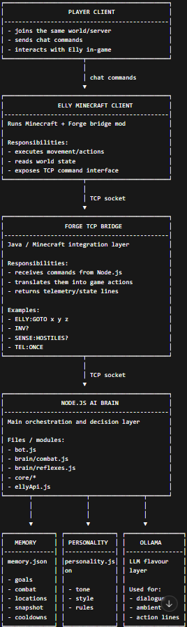

# Elly AI Agent

Elly is a Minecraft companion controlled by a Node.js process and a custom Forge 1.20.1 client mod.

The Forge bridge reads game state and executes actions. The Node.js process parses chat commands, stores memory, runs goals and reflexes, and uses a local Ollama model for dialogue and selected natural-language requests.

## Demo

[Watch the demo on YouTube](https://youtu.be/a2Q9cDu7Eqg)

The demo includes:

- chat interaction with the local language model;
- saved locations and persistent state;
- `follow` and `goto` commands;
- sleep, retreat, farming, combat, and mining behavior.

## Architecture



Elly is split into two processes:

1. The **Forge bridge** runs inside Elly's Minecraft client. It exposes telemetry and game actions through a TCP server bound to `127.0.0.1`.
2. The **Node.js brain** reads Minecraft chat from `latest.log`, maintains state in `memory.json`, and sends commands to the bridge.

```text
Player chat
    |
    v
Minecraft latest.log
    |
    v
Node.js brain
    |  explicit commands, goals, reflexes, optional Ollama dialogue
    v
Serialized TCP client
    |
    v
Forge bridge on 127.0.0.1:25580
    |
    v
Minecraft actions and telemetry
```

## What is controlled by the LLM?

The language model is not part of the real-time combat or reflex loop.

| Behavior | Current control path |
|---|---|
| Combat, retreat, eating, and sleep checks | Deterministic Node.js logic |
| Explicit commands such as `goto`, `follow`, and `fight on` | Deterministic command parser |
| Conversation and ambient comments | Local Ollama model |
| Natural-language action requests | Ollama may propose commands only after an explicit action request; commands are capped and filtered by the active mode |
| Game execution | Forge bridge |

This separation keeps time-sensitive behavior independent from model latency while still allowing natural-language interaction.

## Implemented behavior

- Movement goals: coordinates, saved locations, follow, home, and retreat
- Combat against hostile mobs and hunt mode for passive mobs
- Automatic eating, sleep synchronization, armor selection, and retreat checks
- Farming, mining, inventory inspection, and chest storage
- Environment, biome, position, health, hunger, mob, and inventory telemetry
- Persistent locations, active goals, recent conversation, and runtime state
- Serialized TCP requests with response timeouts
- Optional Ollama dialogue and ambient comments

## Runtime flow

1. A player sends a message beginning with the configured trigger, such as `@elly`.
2. The Node.js process reads the message from the Minecraft log.
3. Explicit commands are parsed without using the language model.
4. Other messages may be passed to Ollama if it is enabled.
5. The brain updates `memory.json` and sends the selected action to the Forge bridge.
6. The bridge executes the action and returns telemetry or a response.
7. A separate interval runs reflexes, combat logic, and active goals.

## Requirements

- Minecraft Java Edition 1.20.1
- Minecraft Forge 47.4.10
- Java 17
- Node.js 20.6 or newer when using the `--env-file` command shown below
- A second Minecraft client for the player
- A Baritone build compatible with Minecraft 1.20.1 for pathfinding and mining commands
- Ollama and `llama3.1:8b` only if dialogue is enabled

Elly and the player must join the same server or LAN world. They can run on the same computer or on separate computers, but the Node.js process and Elly's modded client currently communicate over the local loopback interface.

## Setup

### 1. Build the Forge bridge

From the repository root:

```powershell
cd forge-bridge
.\gradlew.bat build
```

On Linux or macOS:

```bash
cd forge-bridge
./gradlew build
```

The generated JAR is placed in `forge-bridge/build/libs/`. Copy it into the `mods` folder used by Elly's Forge client. Install a compatible Baritone build in the same client.

The bridge still uses the default Forge MDK package and artifact metadata (`examplemod`). Renaming that metadata is planned repository cleanup; it does not change the TCP behavior.

### 2. Install the Node.js dependencies

Return to the repository root and run:

```bash
npm install
```

### 3. Configure the environment

Create `.env` from `.env.example`.

PowerShell:

```powershell
Copy-Item .env.example .env
```

Linux or macOS:

```bash
cp .env.example .env
```

At minimum, set `ELLY_LOG` to the `latest.log` file of Elly's Minecraft instance. Keep `ELLY_PORT` aligned with the bridge port.

Update `UI.json` as well:

- set `botName` to the name used in the chat trigger;
- set `instancePath` if you prefer to derive the log path from the instance folder;
- set `ollamaEnabled` to `false` if you want deterministic commands only.

### 4. Start Minecraft

1. Start Elly's client with Forge, the bridge mod, and Baritone.
2. Start the player client.
3. Join the same server or open the world to LAN.

Using `online-mode=false` is only appropriate for a private test server that is not exposed publicly.

### 5. Start Ollama

This step is optional when `ollamaEnabled` is `false`.

```bash
ollama pull llama3.1:8b
ollama serve
```

### 6. Run the brain

From the repository root:

```bash
node --env-file=.env bot.js
```

If `botName` is `elly`, test the connection from Minecraft chat:

```text
@elly status
@elly goto 100 64 -20
@elly follow PlayerName
```

## Configuration

### Environment variables

| Variable | Default | Purpose |
|---|---|---|
| `ELLY_HOST` | `127.0.0.1` | Forge bridge host |
| `ELLY_PORT` | `25580` | Forge bridge port |
| `ELLY_LOG` | none | Path to Elly's Minecraft `latest.log` |
| `ELLY_MEMORY` | `./memory.json` | Persistent runtime-state file |
| `ELLY_PERSONALITY` | `./personality.json` | Ollama personality configuration |
| `ELLY_MODEL` | `llama3.1:8b` | Local Ollama model |
| `ELLY_MODE` | `auto` | Command filtering mode: `safe`, `assist`, or `auto` |
| `ELLY_LOOP_MS` | `400` | Main brain-loop interval |

Additional thresholds for eating, sleep, retreat, ambient dialogue, and command limits are defined near the top of `bot.js` and can be overridden with environment variables.

### Repository configuration files

- `UI.json` contains the bot name, Minecraft instance path, Ollama switch, system-message switch, and chat cooldown.
- `personality.json` defines dialogue tone and rules.
- `memory.json` stores locations, goals, recent context, and world state while the agent runs.

Do not commit personal server addresses, local filesystem paths, or conversation data from a real session.

## Command overview

| Area | Examples |
|---|---|
| General | `help`, `status`, `stop`, `cancel` |
| Modes | `mode safe`, `mode assist`, `mode auto` |
| Movement | `goto <x> <y> <z>`, `follow <player>`, `retreat` |
| Combat | `fight on`, `fight off`, `hunt on`, `hunt off` |
| Work | `mine <block> [all\|N]`, `farm [radius]` |
| Inventory | `inventory`, `drop`, `store` |
| Safety | `guard on`, `guard notify`, `guard off` |

Run `@elly help` in chat for the command string implemented by the current parser.

## Failure behavior

- TCP commands are serialized to prevent response order from becoming mixed.
- Individual bridge requests use timeouts.
- Secondary telemetry failures are ignored so they do not stop the main loop.
- Invalid `UI.json` content is backed up and replaced with default configuration.
- Ollama failures return a short in-game fallback message.
- A failed bridge connection is logged, but automatic reconnection is not currently implemented.

## Current limitations

- The project has no automated tests or continuous integration.
- Setup requires two Minecraft clients and several local components.
- The Forge project still contains default MDK names and metadata.
- Baritone is required for several navigation and mining behaviors but is not bundled.
- The Node.js process reads Minecraft chat from the client log instead of receiving structured chat events directly.
- `memory.json` is a mutable local state file, not a database or multi-user memory system.
- The first player who sends a valid trigger can become the stored owner unless an owner is configured or reset.
- TCP communication is local-only and has no authentication layer.
- The project has been tested as a personal prototype, not as a packaged mod for unattended use.

## Repository structure

```text
elly-ai-agent/
├── brain/               # combat and reflex logic
├── core/                # telemetry, log, inventory, and environment parsing
├── forge-bridge/        # Forge 1.20.1 TCP bridge source
├── bot.js               # orchestration, commands, goals, memory, and Ollama
├── ellyApi.js           # serialized request/response API
├── tcpLineClient.js     # TCP line transport
├── UI.json              # user-facing runtime settings
├── memory.json          # local mutable state
└── personality.json     # dialogue configuration
```

## Possible next steps

- Rename the Forge MDK package, mod ID, and artifact metadata.
- Add parser and telemetry unit tests.
- Add connection retry with explicit bridge status reporting.
- Move mutable example state out of the tracked `memory.json` file.
- Package the bridge and Node.js configuration into a reproducible release.

## License

The package metadata currently lists ISC, but the repository does not yet include a standalone license file.
